# Architecture

This document describes the architecture and runtime behavior of the Modern C++ TCP Chat Server.

## System Overview

The project is a multithreaded TCP chat server written in C++17 using Linux/POSIX socket APIs.

The server:

- Listens for TCP connections on port `8080`
- Accepts multiple connected clients
- Creates one worker thread per client
- Registers a unique username for each client
- Broadcasts public messages
- Routes private messages by username
- Processes chat commands
- Coordinates graceful shutdown after receiving `SIGINT`

## High-Level Architecture

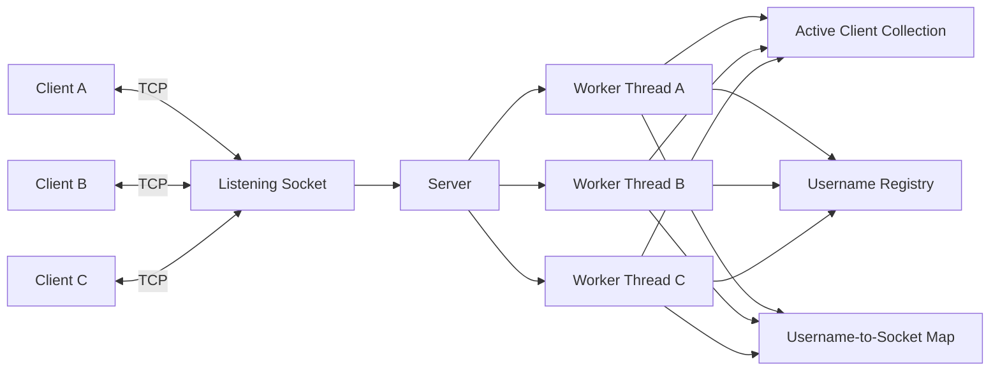

The listening socket accepts incoming connections. Each accepted client socket is placed in shared client storage and handled by a dedicated worker thread.

## Main Components

### `main.cpp`

`main.cpp` is the program entry point.

Its responsibilities are intentionally small:

1. Construct a `Server` object.
2. Start the server with `Server::run()`.
3. Catch exceptions that escape the server.
4. Return an appropriate process exit code.

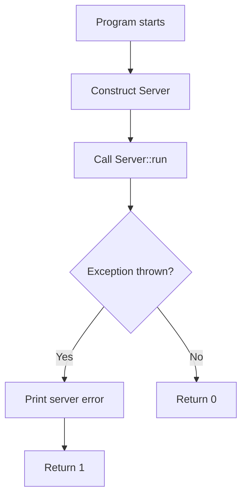

### `Socket`

The `Socket` class owns one operating-system socket file descriptor.

Its responsibilities include:

- Creating a socket
- Binding to a port
- Listening for connections
- Accepting client sockets
- Sending data
- Receiving data
- Shutting down socket operations
- Closing the file descriptor during destruction

The class follows RAII. When a `Socket` object is destroyed, it closes its owned file descriptor automatically.

The class is move-only:

- Copy construction is deleted.
- Copy assignment is deleted.
- Move construction transfers ownership.
- Move assignment transfers ownership.

This prevents two `Socket` objects from accidentally believing that they exclusively own the same file descriptor.

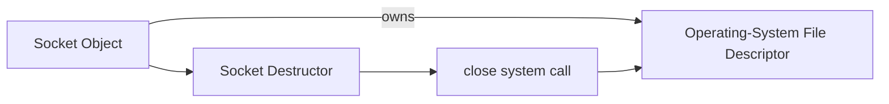

### `Server`

The `Server` class manages the complete chat-server lifecycle.

Its responsibilities include:

- Owning the listening socket
- Accepting new client connections
- Creating client worker threads
- Tracking connected clients
- Registering and removing usernames
- Broadcasting public messages
- Routing private messages
- Processing commands
- Logging server activity
- Coordinating shutdown
- Joining worker threads before destruction

### `TextUtils`

`TextUtils` contains text-processing logic that does not depend on the server or networking system.

Currently it provides:

```cpp
text_utils::removeLineEnding(...)
```

The function removes trailing carriage-return and newline characters from received text.

Keeping this logic separate allows it to be tested independently with GoogleTest.

## Source-Code Dependency Diagram

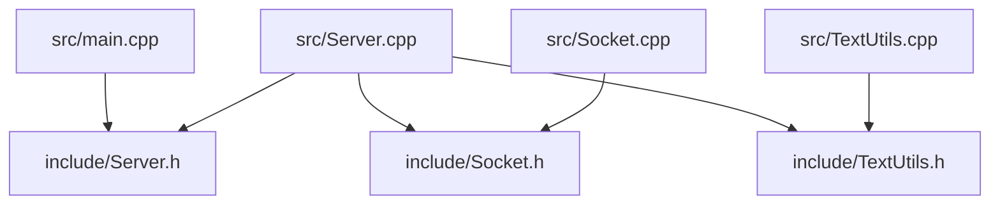

## Connection Lifecycle

When a new client connects:

1. The listening socket accepts the connection.
2. A new `Socket` object owns the accepted file descriptor.
3. The socket is stored in a `std::shared_ptr`.
4. The shared pointer is added to the active-client collection.
5. A worker thread is created for the client.
6. The worker asks the client for a username.
7. The username is registered if it is unique.
8. The client enters the message-processing loop.

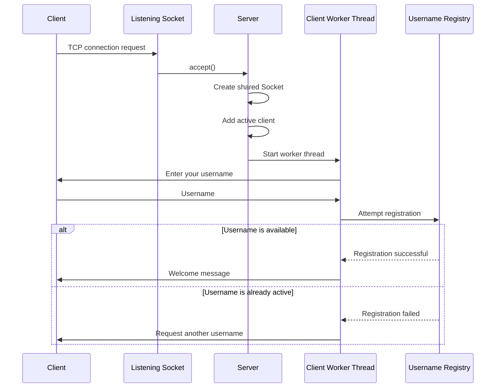

## Worker-Thread Model

The server uses a thread-per-client architecture.

Each connected client has a worker thread that:

- Waits for incoming messages
- Cleans received line endings
- Detects commands
- Broadcasts public messages
- Routes private messages
- Removes the client during disconnection

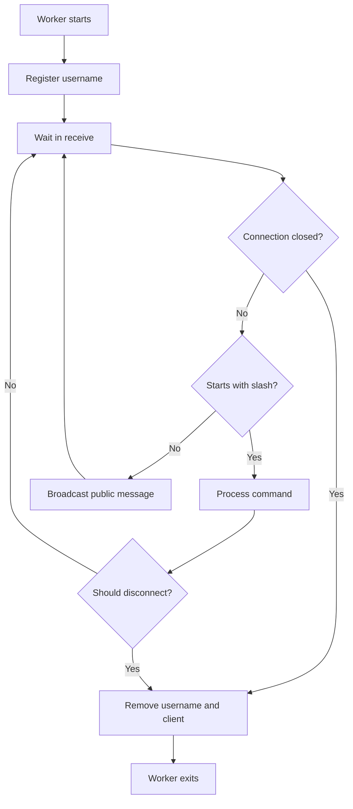

## Public-Message Flow

When Connor sends a public message:

```text
Hello everyone
```

the worker thread formats it as:

```text
Connor: Hello everyone
```

The server sends the formatted message to every active client except Connor.

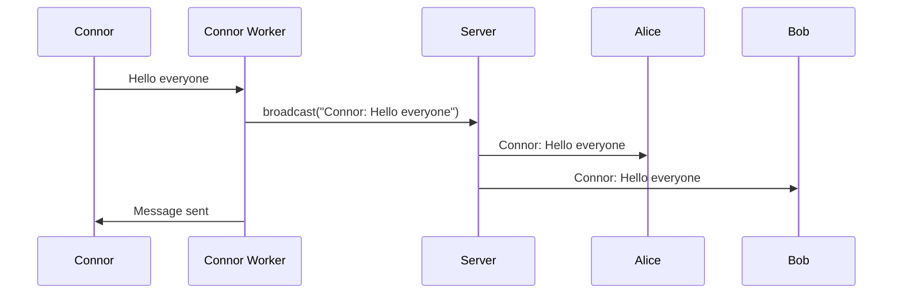

The sender is excluded by comparing socket file descriptors.

## Private-Message Flow

A private message uses the command:

```text
/msg Alice Secret message
```

The worker thread:

1. Parses the recipient username.
2. Parses the message body.
3. Looks up the recipient in the username-to-socket map.
4. Copies the recipient’s shared pointer.
5. Releases the username mutex.
6. Sends the private message.
7. Sends confirmation to the sender.

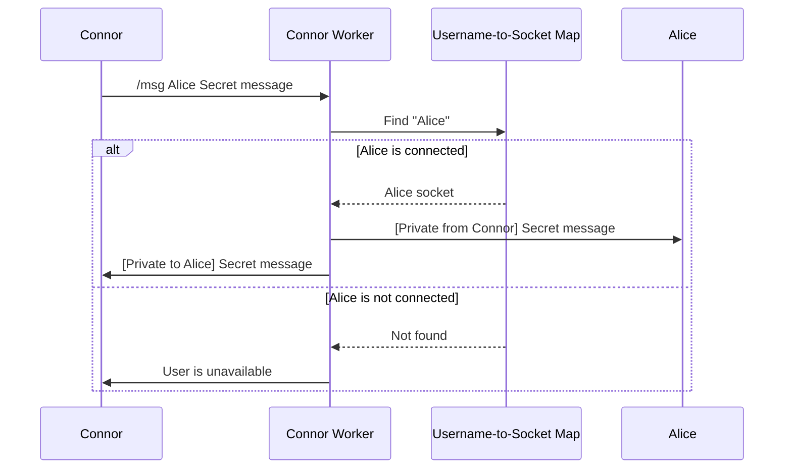

## Command Processing

Supported commands are:

```text
/help
/users
/msg <username> <message>
/quit
```

Command routing follows this general flow:

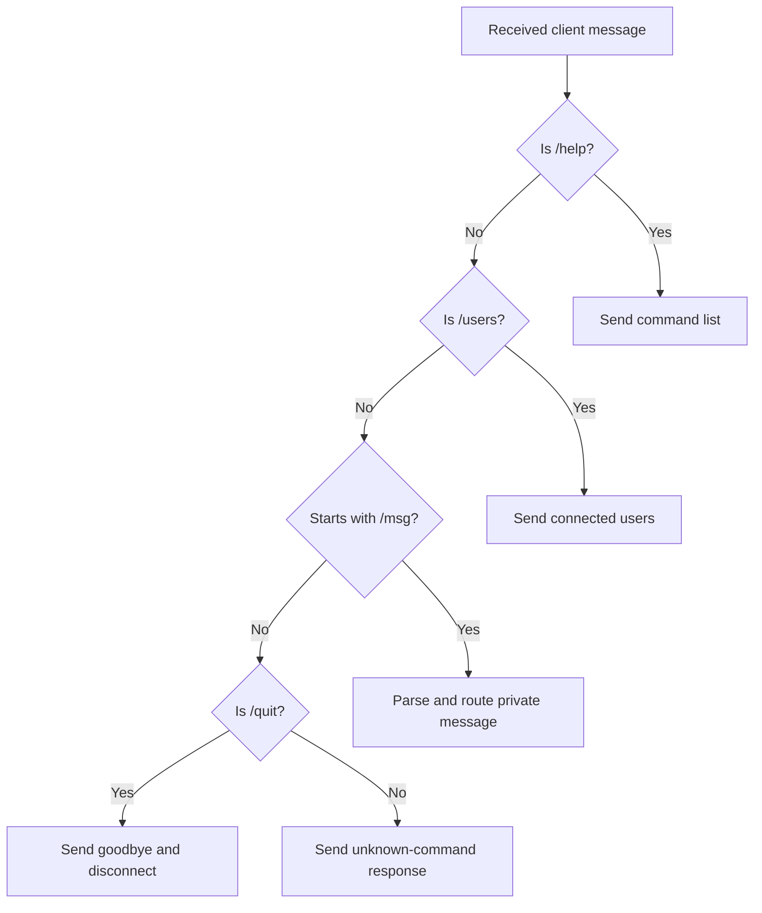

## Shared State and Synchronization

Multiple worker threads access shared server data. Mutexes protect this data from concurrent modification.

### Client mutex

The client mutex protects:

```cpp
std::vector<std::shared_ptr<Socket>> m_clients;
```

This collection contains active client sockets.

Operations protected by the client mutex include:

- Adding a connected client
- Removing a disconnected client
- Iterating over active clients
- Copying active clients during shutdown

### Username mutex

The username mutex protects the relationship between:

```cpp
std::unordered_set<std::string> m_usernames;
```

and:

```cpp
std::unordered_map<
    std::string,
    std::shared_ptr<Socket>
> m_userSockets;
```

These containers share one logical invariant:

> A registered username should have a corresponding socket mapping.

Using one mutex allows registration and removal to update both containers as one protected operation.

### Output mutex

The output mutex protects console logging.

Without it, messages from several worker threads could become interleaved:

```text
[INFO] Conn[WARNING] Alice disor joined...
```

With the mutex, one complete log entry is written at a time.

## Mutex Ownership Diagram

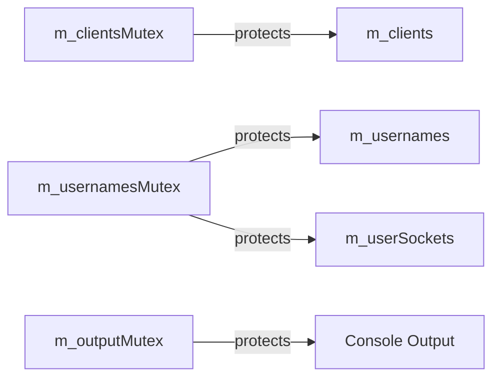

The design uses mutexes by shared responsibility rather than assigning one mutex to every individual variable.

## Graceful-Shutdown Flow

The server handles `Ctrl+C` through `SIGINT`.

The signal handler performs only a minimal operation:

```text
Set the shutdown-requested flag
```

The normal server control flow performs the actual cleanup.

Shutdown proceeds as follows:

1. The process receives `SIGINT`.
2. The signal handler sets the shutdown flag.
3. The blocking `accept()` operation is interrupted.
4. The server stops accepting new clients.
5. The server calls `shutdown()` on active client sockets.
6. Worker threads blocked in `recv()` wake up.
7. Each worker exits its message loop.
8. Workers remove their usernames and client entries.
9. The server joins every worker thread.
10. RAII closes remaining socket file descriptors.
11. The process exits.

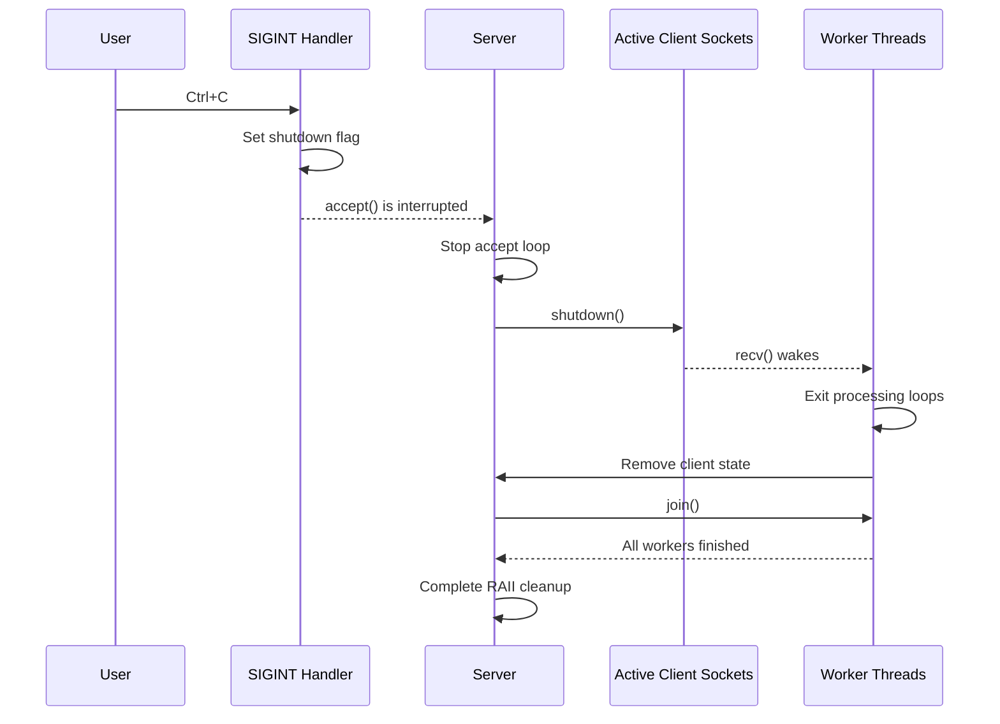

## Why Client Sockets Use `std::shared_ptr`

A connected client socket may be referenced simultaneously by:

- The active-client collection
- Its worker thread
- The username-to-socket map
- A broadcast operation
- A private-message operation
- The shutdown process

`std::shared_ptr<Socket>` allows these operations to temporarily share ownership safely.

The socket is destroyed only after the final shared pointer is released.

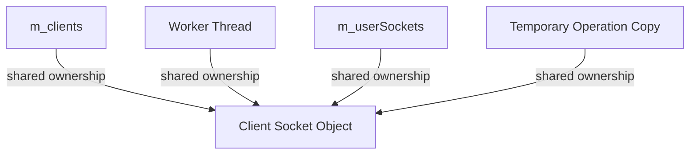

This shared ownership is different from the ownership of the underlying file descriptor.

The `Socket` object has shared ownership, but the file descriptor itself is still exclusively owned by that one `Socket` object.

## Testing Architecture

The project uses different tools for different testing levels.

### C++ unit tests

GoogleTest verifies isolated C++ logic such as line-ending cleanup.

```text
TextUtilsTests.cpp
        |
        v
TextUtils.cpp
```

### Python integration test

The Python test treats the server as an external program.

It:

- Starts the server process
- Connects real TCP clients
- Registers usernames
- Sends public messages
- Sends private messages
- Executes commands
- Sends `SIGINT`
- Verifies clean process termination

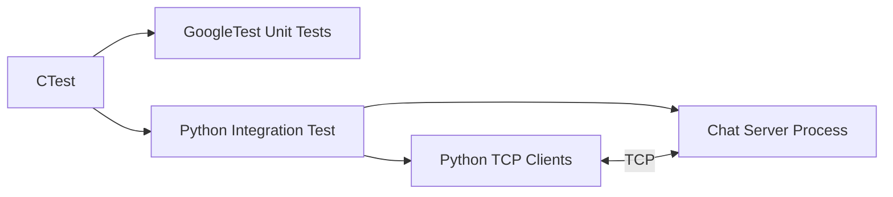

### Continuous integration

GitHub Actions runs the complete test suite in a clean Ubuntu environment.

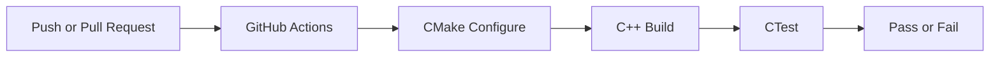

## Design Tradeoffs

### Thread per client

Advantages:

- Straightforward control flow
- Easy to understand
- Each client can block independently in `recv()`
- Appropriate for a learning and portfolio project

Tradeoffs:

- One operating-system thread is created per connected client
- Thread count does not scale as efficiently as an event-driven server
- More advanced production servers may use nonblocking I/O or thread pools

### Shared pointers for clients

Advantages:

- Simplifies lifetime management across threads and containers
- Prevents sockets from being destroyed while another operation uses them

Tradeoffs:

- Ownership is less obvious than with unique ownership
- Reference counting introduces some overhead
- Care is required to avoid ownership cycles

This project does not create a shared-pointer cycle because the `Socket` objects do not own the `Server` or the containers that reference them.

### POSIX APIs

Advantages:

- Provides direct experience with Linux networking
- Exposes file descriptors and system-call behavior
- Relevant to systems and embedded-adjacent C++ development

Tradeoffs:

- The current networking layer is Linux/POSIX-specific
- Portability to Windows would require a platform abstraction or Winsock implementation

## Potential Future Improvements

Possible future extensions include:

- Message framing instead of relying on newline-delimited input
- Per-client outgoing-message queues
- A fixed-size worker pool
- Nonblocking I/O using `poll`, `select`, or `epoll`
- Configurable host and port settings
- Authentication
- Encrypted communication
- Additional unit tests for command parsing
- Stress and concurrency tests
- Sanitizer builds
- Multiple compiler configurations in continuous integration